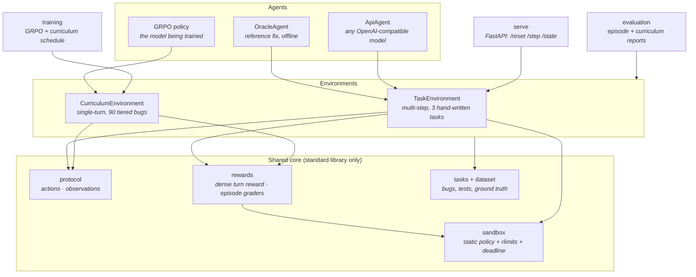

# AgentDebuggerEnv

[](https://github.com/PulipatiPranav/AgentDebuggerEnv/actions/workflows/ci.yml)
[](LICENSE)
[](https://www.python.org/downloads/)

**A reinforcement-learning environment that teaches language models to debug the way engineers do — observe, hypothesise, then fix — instead of guessing.** An agent is shown broken Python and real test output, must state a hypothesis before it is allowed to run a fix, and every submission executes in a resource-limited sandbox that scores what it actually did.

<p align="center">
  
</p>

<p align="center">
  <code>pip install -e .</code> · runs on CPU · no GPU or API key needed for the demo
</p>

---

## Why it exists

Ask a language model to fix a bug and it will usually produce something plausible. Watch it on a *subtle* bug and the failure mode is consistent: it pattern-matches a fix, states it with confidence, and never checks whether the fix addresses the actual cause. That is an incentive problem, not an intelligence one — models are trained to complete text, not to reason under a test harness that pushes back.

AgentDebuggerEnv changes the incentive. The reward is dense and structured: it pays for stating a specific hypothesis, for localising the bug, for a fix that passes the tests, and it charges for breaking tests that used to pass or for submitting a fix with no reasoning at all. A model trained here learns that the reasoning step is what pays.

## Key features

- **A hardened execution sandbox.** Model-generated code runs in a short-lived subprocess with static import/builtin analysis, kernel-enforced CPU/memory/file-size limits, and a wall-clock deadline that kills the whole process group. Escapes an LLM actually tries — `import os`, `open('/etc/passwd')`, `eval`, `().__class__.__subclasses__()` — are refused *before* execution; legitimate fixes that need `hashlib`, `threading` or `super()` run fine.
- **Three tasks, three failure modes.** An off-by-one you solve by reading the error; a red herring where the error points at the wrong function; and a race condition that **passes every sequential test** and only a concurrency stress test reveals.
- **A dense, itemised reward** with a defended range of `[-0.5, 1.0]`, decomposed into format, hypothesis quality, localization, fix correctness, similarity, efficiency and penalties — so a weak policy still gets a gradient to climb.
- **A tiered curriculum** (90 hand-checked bugs across three difficulty tiers) that unlocks harder bugs only once the easy ones stabilise, avoiding the early policy collapse a flat distribution causes.
- **GRPO training** on `Qwen2.5-Coder-3B-Instruct` with LoRA, scored by the *same* function the evaluator uses — so a reward curve and an eval number mean the same thing.
- **Runs offline.** The core package is pure standard library. An oracle agent lets anyone watch a full episode — sandbox, grader and all — with no GPU and no API key.

## Architecture



Every path to "did this fix work?" runs through one sandbox and one test runner, so the environments, the reward function, the graders and the dataset validator can never disagree about what a passing test means.

## Installation

Requires Python 3.10+ on Linux or macOS. The kernel resource limits are enforced where the kernel supports them: on Linux, all of them. macOS accepts the address-space (memory) ceiling but does not enforce it, so a runaway allocation there is caught by the wall-clock deadline rather than failing fast with a `MemoryError`. The deadline and the static import/builtin policy apply on every platform.

```bash
git clone https://github.com/PulipatiPranav/AgentDebuggerEnv.git
cd AgentDebuggerEnv
python -m venv .venv && source .venv/bin/activate
pip install -e .
```

The core install pulls **no third-party dependencies**. Heavier features are opt-in extras:

| Extra | Adds | For |
| --- | --- | --- |
| `.[serve]` | FastAPI, Uvicorn | the HTTP environment |
| `.[api]` | OpenAI client | evaluating hosted models |
| `.[train]` | Torch, TRL, PEFT, transformers | GRPO training and local eval |
| `.[dev]` | pytest, ruff | development |

## Quickstart

On a CPU-only machine, from a fresh checkout — about a minute, no GPU, no API key:

```bash
python -m venv .venv && source .venv/bin/activate
pip install -e .

# Watch an agent debug the race-condition task, end to end
agentdebugger episode --task hard

# Score the reference agent on all three tasks
agentdebugger evaluate

# Check that every bug in the dataset is genuinely broken and genuinely fixable
agentdebugger validate
```

`agentdebugger episode` runs the oracle agent by default, which submits the known-good fix — so you can see the environment, sandbox and grader working without any model. To point the same episode at a real model:

```bash
export API_BASE_URL=https://router.huggingface.co/v1
export HF_TOKEN=hf_...
pip install -e '.[api]'
agentdebugger episode --task hard --agent api --model meta-llama/Llama-3.1-70B-Instruct
```

## Repository structure

```text
src/agentdebugger/
├── config.py            # sandbox limits and the curriculum schedule
├── protocol.py          # actions, observations, structured-response parsing
├── sandbox/             # policy (static analysis) · runner (rlimits) · cases (test runner)
├── tasks/               # the three hand-written tasks + shared test harness
├── dataset/             # the 90-bug tiered dataset, its loader and its validator
├── rewards/             # dense turn reward (training) · episode graders (tasks)
├── envs/                # TaskEnvironment (multi-step) · CurriculumEnvironment (single-turn)
├── agents/              # oracle (offline) · api (OpenAI-compatible)
├── evaluation/          # episode and curriculum evaluation, with JSON reports
├── training/            # GRPO trainer, prompts, hardware-scaled batch geometry
├── serve/               # FastAPI server for the multi-step environment
└── cli.py               # the `agentdebugger` command
docs/                    # technical report, architecture notes, research plan
scripts/render_demo.py   # regenerates the README GIF from the live CLI
tests/                   # sandbox, rewards, graders, environment, claim-critical tests
results/                 # published evaluation results
```

## Development

```bash
pip install -e '.[dev]'
ruff check src tests      # lint
pytest                    # the full suite (~40s)
```

The `serve` and `train` code paths import their heavy dependencies lazily, so `import agentdebugger` never pulls in FastAPI or Torch — importing the package and running the whole core test suite needs nothing beyond the standard library and pytest.

To regenerate the demo GIF after a CLI change:

```bash
pip install pyte pillow      # plus ffmpeg on PATH
python scripts/render_demo.py --out docs/images/demo.gif
```

## Testing

The suite is organised around the project's claims rather than around files. The load-bearing ones:

- **`tests/test_sandbox.py`** — every escape an LLM actually attempts is refused before execution; CPU, memory, file-write and wall-clock limits are enforced; timeouts kill the whole process group; the stdlib a real fix needs still imports.
- **`tests/test_rewards.py`** — a perfect first-turn solve scores exactly `1.0`, the total never drops below `-0.5`, confidence is calibrated, and similarity to the reference fix can never substitute for passing the tests.
- **`tests/test_graders.py`** — submitting nothing scores zero on every task (including the hard one, where the buggy code passes every sequential test); grading is deterministic.
- **`tests/test_claims.py`** — one test per sentence in this README and the report that a reader could challenge: the reward range, the curriculum schedule, the mandatory hypothesis, and that training and evaluation share a single scoring path.

The default run includes the dataset-wide sandbox check, which executes all 90 bugs. Deselect it when iterating:

```bash
pytest                    # everything (~25s)
pytest -m "not slow"      # skip the dataset-wide sandbox check
```

Both `ruff check` and `pytest` run in [CI](.github/workflows/ci.yml) on every push and pull request, across Python 3.10–3.13.

## Training and results

The published run trains `Qwen2.5-Coder-3B-Instruct` with GRPO and LoRA over the curriculum. See [docs/report.md](docs/report.md) for the method, the reward design, and the reward curves; per-bug results are in [results/](results/).

```bash
pip install -e '.[train]'
agentdebugger train --max-steps 500
agentdebugger evaluate-curriculum --adapter <your-hf-repo>
```

The trainer scales batch geometry to the detected GPU (T4 through H100) and swaps the bug pool at each curriculum boundary. It needs a CUDA GPU; everything else in this repository runs on CPU.

## Research plan

The three ideas this environment is built on — that structured Observation → Hypothesis → Action reasoning helps, that decomposing the reward helps, and that the curriculum prevents collapse — are **claims, not results**. [docs/research_plan.md](docs/research_plan.md) states each one as a falsifiable hypothesis with a null, a metric and an acceptance criterion, and specifies the smallest experiment matrix that could test them.

Read it before citing anything in [results/](results/): the published run has **no train/held-out split**, so its solve rate measures how well the policy fit the training bugs, not whether it learned to debug. Fixing that is a precondition for the experiments, not one of them.

## Contributing

Contributions are welcome — start with [CONTRIBUTING.md](CONTRIBUTING.md) and the [good first issues](docs/good_first_issues.md). Release history is in [CHANGELOG.md](CHANGELOG.md).

## Authors

- **Shashaank Jain** ([@shasshaank](https://github.com/shasshaank))
- **Pranav Pulipati** ([@PulipatiPranav](https://github.com/PulipatiPranav))

## License

MIT — see [LICENSE](LICENSE).
