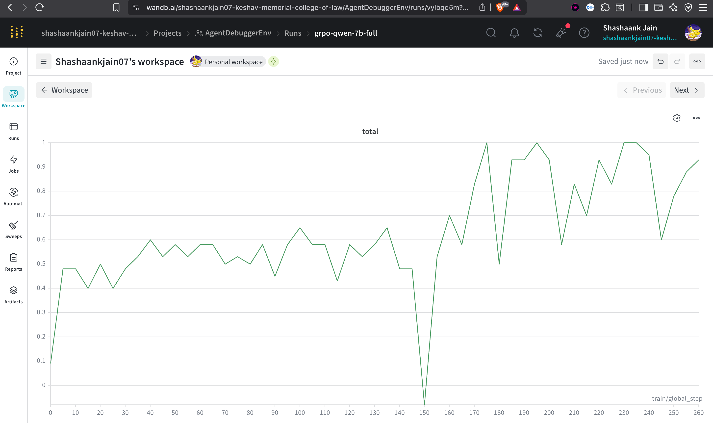
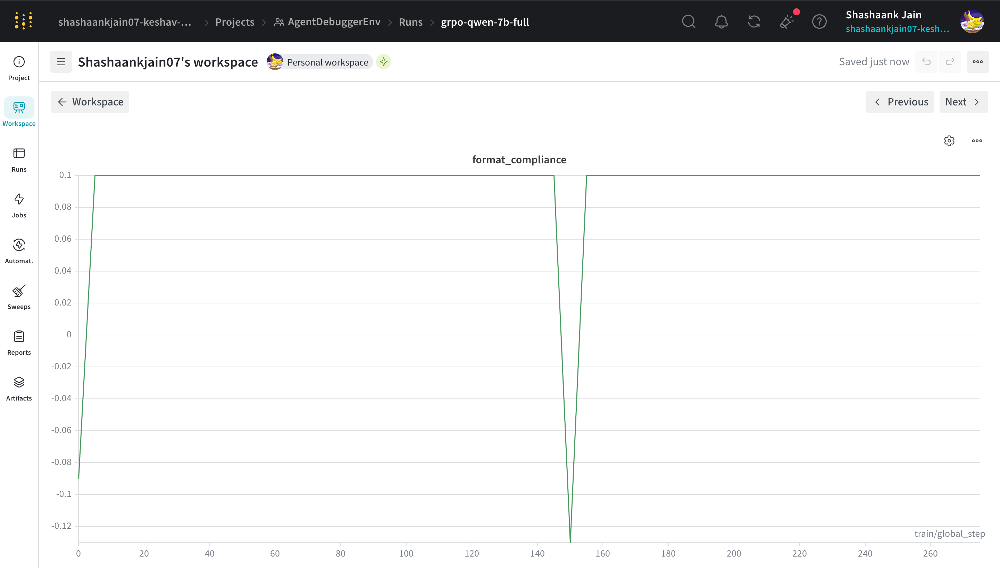
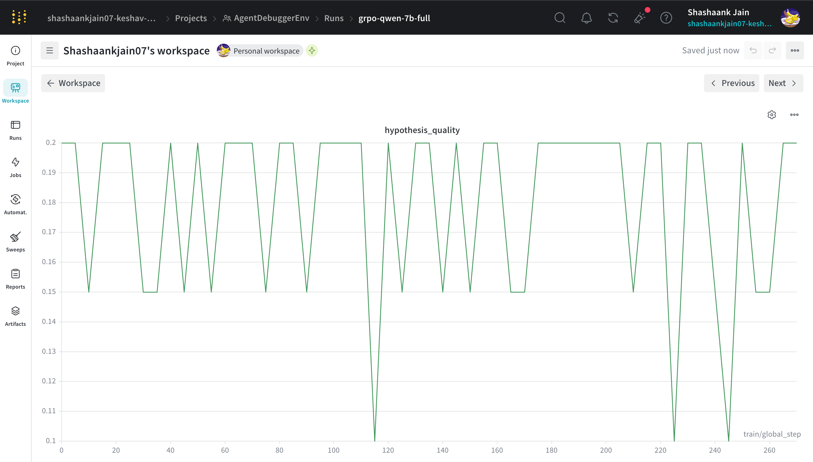
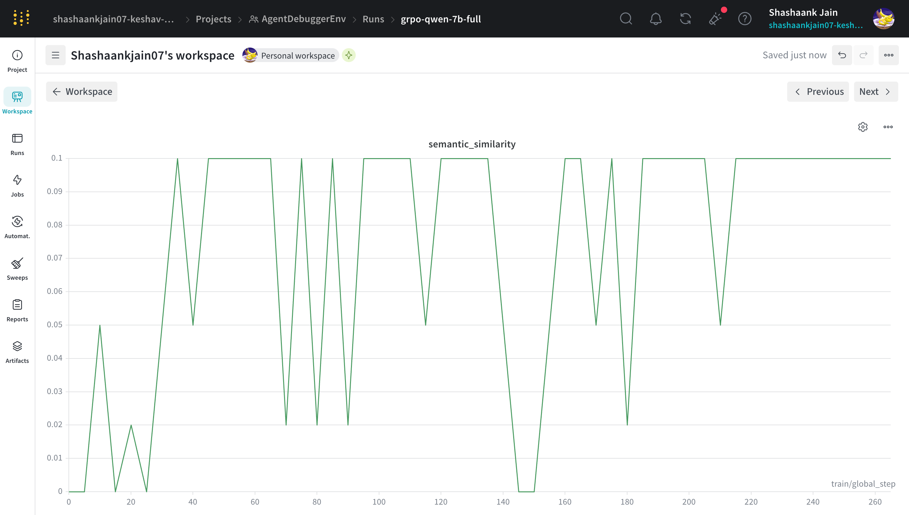

# AgentDebuggerEnv

**Hackathon Links:**
- 🌌 **[Live Hugging Face Space](https://huggingface.co/spaces/shashaank0707/AgentDebugger-training-v3)** 
- 📹 **[Watch the 2-Minute Demo](#)** *(Replace with YouTube Link)*
- 📝 **[Read the Technical Writeup](#)** *(Replace with HF Blog Link)*

### 🚀 One-Line Pitch
An OpenEnv-backed reinforcement learning environment that trains LLMs to debug code systematically via Group Relative Policy Optimization (GRPO) and secure sandbox execution.

### 💡 Why This Exists
LLMs often hallucinate bug fixes via blind trial-and-error. Real debugging in production requires hypothesis-driven reasoning, isolation, and verification. We engineered an environment that forces models to observe, hypothesize, and execute code within a secure sandbox—penalizing blind guessing and explicitly rewarding structured problem-solving.

### 🧠 Key Technical Insights & Research Foundations
* **Hypothesis-Driven Debugging (NeurIPS 2025):** Recent research presented at NeurIPS demonstrates that forcing an LLM to formulate a concrete hypothesis before generating code significantly improves debugging accuracy. Inspired by this, our environment mandates a strict `OBSERVATION` → `HYPOTHESIS` → `ACTION` loop. Every single step taken by the agent must be preceded by a formal hypothesis to receive a positive reward.
* **Literature-Backed Reward Criteria:** Our continuous, multi-objective reward shaping architecture is heavily influenced by the latest findings in LLM reasoning and code generation capabilities, specifically drawing from:
  * [arXiv:2408.10215](https://arxiv.org/abs/2408.10215)
  * [arXiv:2601.19100](https://arxiv.org/abs/2601.19100) (Amazon NeurIPS Paper)
* **Curriculum Learning for RL:** A flat bug distribution caused early policy collapse. We implemented a 3-tier curriculum, introducing complex logic bugs only after structural formatting and syntax localization stabilized.
* **Hardened Sandboxed Grading:** Evaluating arbitrary LLM-generated fixes introduces severe RCE risks. We engineered a secure execution sandbox that restricts execution time, limits memory, and completely replaces unsafe `exec()` calls, ensuring deterministic and safe grading.

### 🏗️ Architecture Overview
* **OpenEnv Core:** Manages state transitions, agent interactions, and environment telemetry.
* **Grader Subsystem:** Multi-layered evaluation utilizing a Hard Grader (secure execution, deterministic AST matching) and a Soft Grader (Llama-3.1-70B semantic evaluation).
* **Trainer:** HuggingFace TRL GRPO pipeline with dynamic batch scaling based on runtime VRAM detection.
* **Live Monitor:** A Gradio dashboard streaming `stdout` and Weights & Biases metrics directly from the active training container.

### ⚡ What Makes This Impressive
* **Zero-to-One in 250 Steps:** Achieved a ~2.5x increase in total reward within just 250 steps, demonstrating extreme sample efficiency via GRPO.
* **Dynamic Hardware Scaling:** The training pipeline natively detects hardware capability (A100/H100 vs. T4) and automatically scales `batch_size`, `grad_accum`, and compute `dtype` (`bfloat16`/`float16`)—eliminating OOM errors across deployment environments.
* **Frictionless Deployment:** Bypassed heavy dependency constraints (PyTorch/TRL vs. Gradio PIP conflicts) by engineering a lazy-loading runtime environment that ensures deterministic Docker builds.

### 🛠️ Tech Stack
* **Frameworks:** OpenEnv, FastAPI, Docker
* **RL Pipeline:** HuggingFace TRL (GRPO), Peft (LoRA)
* **Models:** Qwen2.5-Coder-7B-Instruct (Base), Llama-3.1-70B (Evaluator)
* **Telemetry:** Weights & Biases

### 📊 Results & Benchmarks
Our training run clearly demonstrates rapid policy adaptation. The model successfully learned the `OBSERVATION/HYPOTHESIS/ACTION` constraint almost instantly and navigated the tier-2 difficulty bump (step 150) with a textbook drop-and-recover curve.

## Training Results
[W&B Run](https://wandb.ai/shashaankjain07-keshav-memorial-college-of-law/AgentDebuggerEnv/runs/vylbqd5m?nw=nwusershashaankjain07) | [Colab Notebook](#) | [YouTube Demo](#) | [HF Blog](#)

*(Note for Hackathon Judges: Live Weights & Biases charts and Gradio UI are embedded below as evidence of the training run).*




*Additional Training Metrics:*
<p align="center">
  
  
</p>


* **Format Compliance:** Scaled to 1.0 (max) within 50 steps.
* **Total Reward:** Scaled from baseline ~0.4 to peaks of ~1.0 by step 250.
* **Baseline Solve Rate:** 100.0% validation on tiered data structure.

### 🔥 Challenges & How They Were Solved
* **Reward Hacking:** Initial RL runs showed the model farming points by writing functionally valid code that bypassed the actual bug. **Fix:** Recalibrated the Hard Grader to execute both the initial buggy code and the proposed fix, computing the delta to ensure points are *only* awarded for actual regression fixes.
* **Hugging Face Space Build Failures:** The Space suffered from "resolution-too-deep" PIP timeouts due to conflicting requirements between Gradio and `trl/accelerate`. **Fix:** Stripped `requirements.txt` to the bare minimum for the UI and engineered a lazy-load script that installs training dependencies post-boot in a background thread.
* **Flaky LLM-as-a-Judge:** Using LLMs to grade code functionality proved non-deterministic. **Fix:** Replaced LLM evaluation for execution success with the deterministic Python sandbox, reserving the LLM judge solely for evaluating the semantic quality of the hypothesis.

### ▶️ Quick Start

We built the training pipeline to be universally runnable, with a specific focus on reproducible execution for judging.

**Run the Training Notebook**
The easiest way to re-run the exact GRPO training pipeline is via our Jupyter Notebook. It auto-detects hardware and sets configurations accordingly.
1. Open `training/AgentDebuggerEnv_GRPO_Training.ipynb` in Google Colab or Kaggle.
2. Select a GPU runtime (T4, A100, etc.).
3. Run all cells. It will automatically install dependencies and start streaming results.


### 📂 Code Structure
```text
├── data/               # Tiered bug datasets (JSONL)
├── env/                # OpenEnv environment definitions
├── server/             # FastAPI backend & Grader implementations
│   ├── grader_hard.py  # Sandboxed deterministic code execution
│   └── grader_soft.py  # Semantic evaluation logic
├── training/           # GRPO pipeline & Runnable Notebook
└── app.py              # Gradio training monitor
```

### 🤝 If I Had More Time
* **Multi-File Contexts:** Expand the environment to handle complex multi-file repository debugging using an active Language Server Protocol (LSP) integration.
* **PPO vs GRPO Benchmarking:** Quantify the compute and efficiency tradeoffs between PPO and GRPO on this specific task.
* **Adversarial Bug Generation:** Implement an adversarial LLM agent to continuously mutate and generate edge-case bugs, creating an infinite, self-sustaining curriculum.

---

### 👥 Team Endurance
* **Shashaank Jain** | GitHub: [@shasshaank](https://github.com/shasshaank) | Email: *[Add Email]*
* **[Pranav Pulipati]** | GitHub: *[@PulipatiPranav](https://github.com/PulipatiPranav)* | Email: *[pranavpulipatix@gmail.com]*
